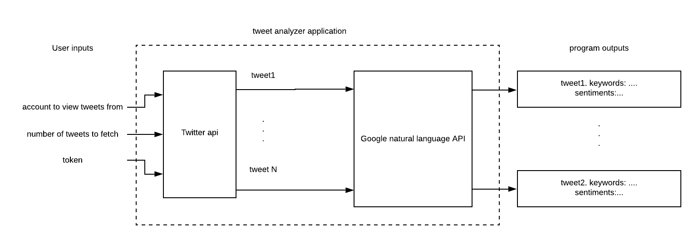
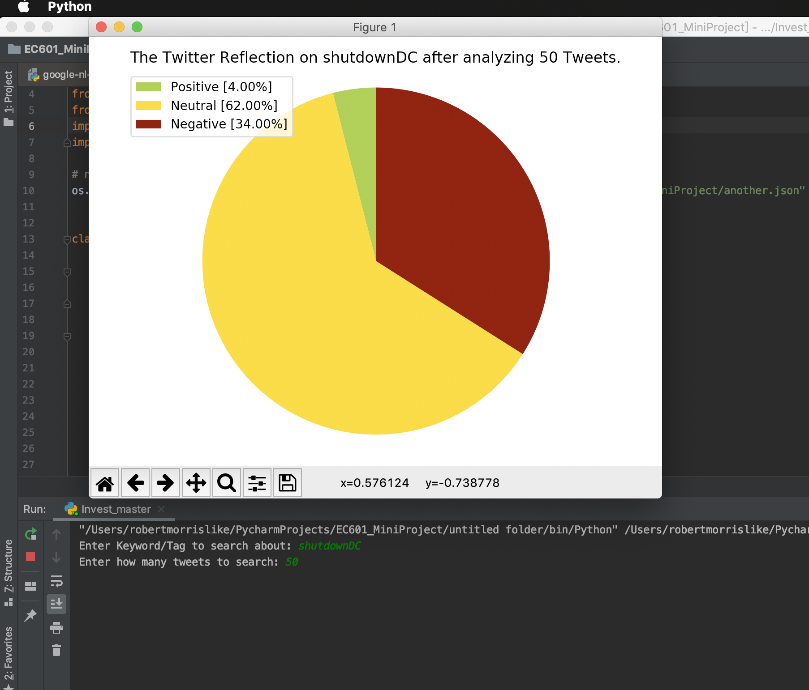
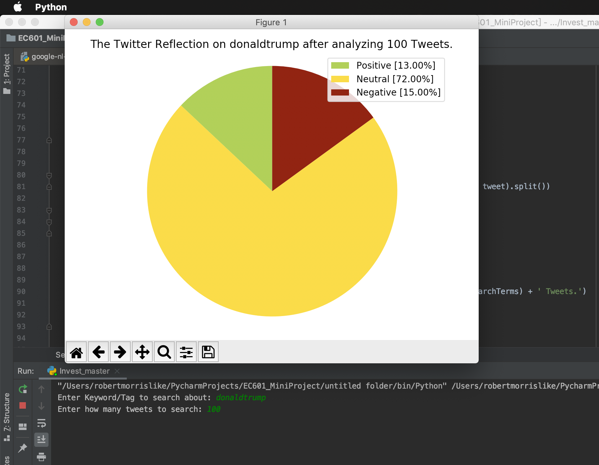
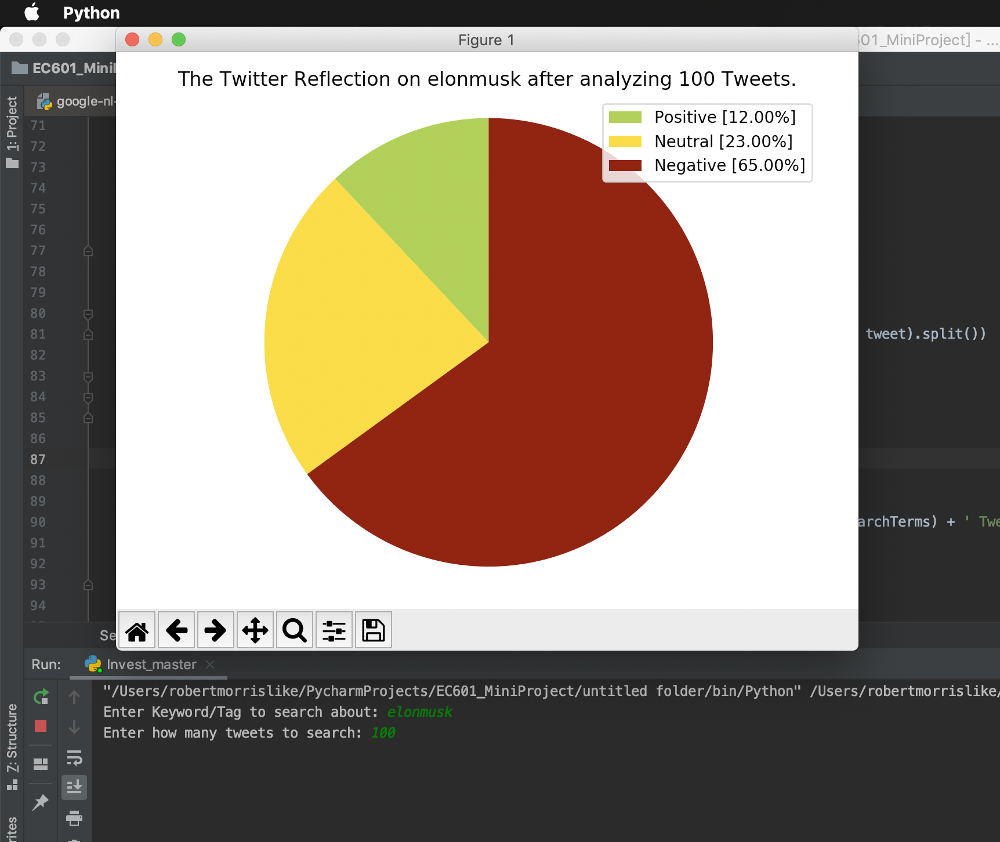

# EC601_twitter_keyword
an application that process tweets and generate keywords with google natural language api

# Product Mission

## Target Users

Investors who need to analyze newest decisions, movements and trends of the leaders of all industries such as technology, entertainment and event politics in order to assess the reflection on the market and further predict the price of stocks.

## User story

As a stock invester with a focus on American technology companies, I want to analyze tweets from president Trump, as well as top tech CEOs such as Elon Musk, to project the trend of stock market. If I can extract keywords and sentiments from a tweet, I can guess the situation of a company or industry, which can help me make trade decision

## Minimum Valuable Product

As for MVP, user can choose a particular topic or person and specify the number of tweets for the system to gather and then analyze.
In this way, user will get the sentiment feedback of gathered tweets about this keyword and the pie chart analysis as well.

# System Design

System design is shown above.

From the user input we acquire the keyword and the number of tweets to be analyzed as parameters, then using twitter API and the developer account we access to the tweets. After teh data(tweets) preprocessed (format), then the contents of those tweets about the keyword is transmitted into Google natural language API which will provide us with the sentiment score of these tweets. The score between [-1,-0.25] is determined as "Negative" attitude, the score between [-0.25,0.25] is determined as "Neutral" attitude and score between [0.25,1] is determined as "Positive" attitude. By the result of the score we get the percentage of each kind of attitude on this keywords and therefore we have the feedback of those tweets sentiment.

# How to build other system

1. create new project and get the access key and secret on Twitter API
2. create new project and get the access key and secret JSON file on Google Natural language API
3. create Python project to get user input (keyword and number of tweets)
4. run test program to make sure code runnable
5. update the result visualizer using matplotlib library

# Testing

By analyzing those twitter feedback we can predict the attitude of public and further decide the investment strategy.

# Lessons Learned

## What you liked doing?

I like working for a part of a big project 

## What you could have done better?

I could do more specific and useful data analysis with the sentiment acquired

## What you will avoid in the future?

Not doing my working and stacking it right before the due

